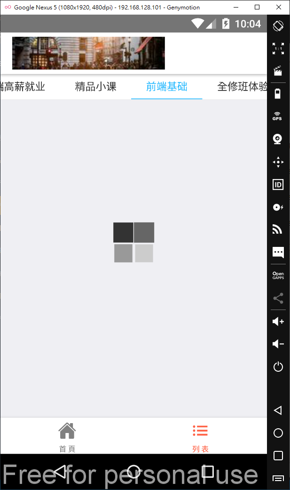
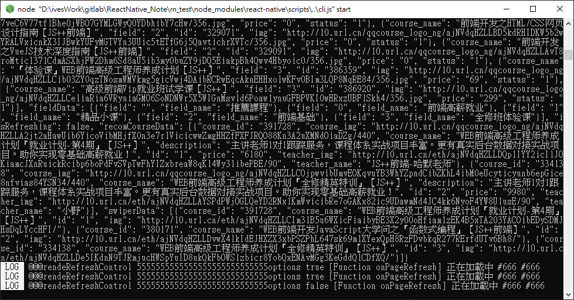
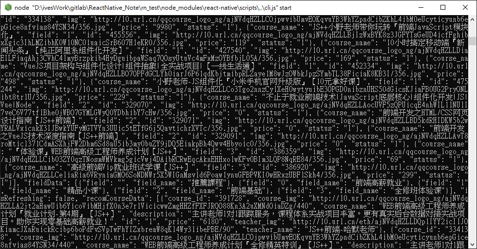

# ReactNative 騰訊課堂 簡易App

使用ReactNative完成簡易app(android、ios)

# 使用技術

- react-navigation/bottom-tabs: "^6.0.9",
- react-navigation/native: "^6.0.6",
- react-navigation/native-stack: "^6.2.5",
- react": "17.0.2,
- react-native": "0.66.4,
- react-native-safe-area-context: "^3.3.2",
- react-native-screens: "^3.10.1",
- react-native-swiper: "^1.6.0",
- react-native-tab-navigator: "^0.3.4",
- react-native-vector-icons: "^9.0.0",
- react-native-webview: "^11.15.0"
- fetch

# android頁面展示

首頁->輪播圖、推薦課程

首頁->前端高薪就業

首頁->精品小課

首頁->前端基礎

列表->全部課程

列表->精品小課

列表->全修班體驗

列表->前端基礎(加載動畫)

首頁->下拉刷新(上方有加載動畫)

點任一課程會進入對應的詳情頁(使用WebView)

數據加載(使用真實接口)

數據加載(使用真實接口)

# ios頁面展示

待補

fetch請求在ios上會失敗，之後有時間再解

# 建立模板項目

參考之前筆記

https://github.com/IvesShe/ReactNative_Note